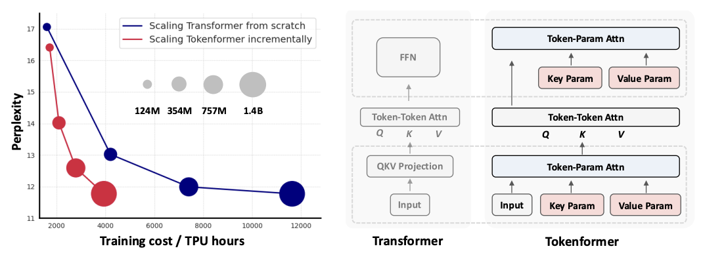
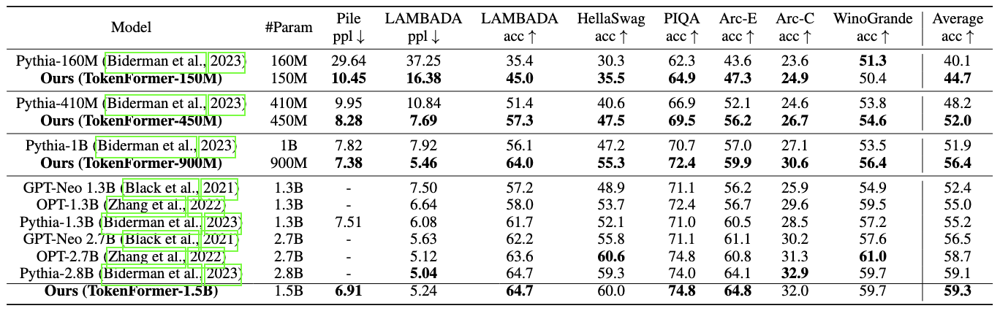

# TokenFormer


<div align="center">
  
</div>

## 项目简介

TokenFormer是一个开创性的神经网络架构，将模型参数进行token化实现了**完全基于注意力机制**的计算框架。

- **参数token化**：首次将模型参数转换为token，与输入数据token在同一注意力空间中交互
- **Pattention机制**：提出了参数注意力（Parameter Attention）机制，统一处理token-token和token-parameter交互  
- **原生可扩展**：支持渐进式模型扩展，无需从头重新训练大模型
- **架构统一**：token化实现了数据、参数和记忆的统一表示


## 项目架构

```
TokenFormer/
├── configs/                    # 配置文件
│   ├── tokenformer/           # TokenFormer专用配置
│   ├── llama/                 # LLaMA模型配置
│   └── incremental_scaling/   # 增量扩展配置
├── megatron/                  # 核心框架
│   ├── model/                 # 模型实现
│   │   ├── tokenformer.py    # TokenFormer主要实现
│   │   └── ...
│   ├── training.py           # 训练逻辑
│   └── ...
├── eval_tasks/               # 评估任务
├── tools/                    # 工具脚本
├── requirements/             # 依赖管理
├── train.py                  # 训练入口
├── eval.py                   # 评估入口
└── generate.py              # 推理入口
```

## 环境安装

### 系统要求

- **Python**: 3.8 
- **CUDA**: 12.0+ 
- **PyTorch**: 2.2.1+
- **GPU**: 支持NVIDIA GPU（单卡或多卡）

### 安装步骤

1. **创建环境**
```bash
conda create -n TokenFormer python=3.8
conda activate TokenFormer
```

2. **克隆项目**
```bash
git clone https://github.com/Haiyang-W/TokenFormer.git
cd TokenFormer
```

3. **安装PyTorch**
```bash
pip install torch==2.2.1 torchvision==0.17.1 torchaudio==2.2.1 --index-url https://download.pytorch.org/whl/cu121
```

4. **安装依赖**
```bash
# 基础依赖
pip install -r requirements/requirements.txt

# 可选组件
pip install -r requirements/requirements-flashattention.txt  # 需要 GCC > 9
pip install -r requirements/requirements-wandb.txt          # WandB日志
pip install -r requirements/requirements-tensorboard.txt    # TensorBoard日志
```

5. **安装APEX**
```bash
git clone https://github.com/NVIDIA/apex
cd apex
pip install -v --disable-pip-version-check --no-cache-dir --no-build-isolation \
    --config-settings "--build-option=--cpp_ext" \
    --config-settings "--build-option=--cuda_ext" ./
```

## 开始

### 模型推理

1. **下载预训练模型**
```bash
# 从HuggingFace下载
git lfs clone https://huggingface.co/Haiyang-W/TokenFormer-150M
```

2. **零样本评估**
```bash
python ./deepy.py eval.py -d configs tokenformer/150M_eval.yml \
    --eval_tasks lambada_openai hellaswag piqa arc_challenge arc_easy winogrande
```

3. **文本生成**
```bash
python ./deepy.py generate.py -d configs tokenformer/150M_eval.yml \
    --text_gen_type input-file \
    --sample_input_file input.txt \
    --sample_output_file output.txt
```

### 数据准备

1. **准备小型数据集（快速测试）**
```bash
python prepare_data.py -d ./data -t HFTokenizer --vocab-file tokenizer.json openwebtext2
```

2. **准备Pile数据集（完整训练）**
```bash
python prepare_data.py -d ./data -t HFTokenizer --vocab-file tokenizer.json pile
```

### 模型训练

1. **单节点训练**
```bash
CUDA_VISIBLE_DEVICES=0,1,2,3,4,5,6,7 \
python deepy.py train.py configs/tokenformer/150M_train_pile.yml
```

2. **多节点训练（Slurm）**
```bash
# 修改配置文件
vim configs/tokenformer/150M_train_pile.yml
# 设置 "launcher": "slurm", "deepspeed_slurm": true

```

### 增量扩展训练

```bash
# 下载354M基础模型
wget https://huggingface.co/Haiyang-W/TokenFormer-354M-Openwebtext2/resolve/main/354M_TokenFormer_Openwebtext2.zip
unzip 354M_TokenFormer_Openwebtext2.zip

# 执行增量扩展（354M → 757M）
python deepy.py train.py configs/incremental_scaling_openwebtext2/354M_to_757M_train_openwebtext2_60k.yml
```

## 模型性能

### 预训练模型列表

| 模型 | 参数量 | 层数 | 隐藏维度 | 下载链接 | 配置文件 |
|------|--------|------|----------|-----------|----------|
| TokenFormer-150M | 150M | 12 | 768 | [🤗 HF](https://huggingface.co/Haiyang-W/TokenFormer-150M) | [config](configs/tokenformer/150M_eval.yml) |
| TokenFormer-450M | 450M | 24 | 1024 | [🤗 HF](https://huggingface.co/Haiyang-W/TokenFormer-450M) | [config](configs/tokenformer/450M_eval.yml) |
| TokenFormer-900M | 900M | 32 | 1280 | [🤗 HF](https://huggingface.co/Haiyang-W/TokenFormer-900M) | [config](configs/tokenformer/900M_eval.yml) |
| TokenFormer-1.5B | 1.5B | 40 | 1536 | [🤗 HF](https://huggingface.co/Haiyang-W/TokenFormer-1-5B) | [config](configs/tokenformer/1-5B_eval.yml) |

### 零样本评估结果

<div align="center">
  
</div>

### 增量扩展性能

| 模型 | 策略 | 迭代次数 | 验证困惑度 | 训练效率 |
|------|------|----------|------------|----------|
| TokenFormer-354M | 从头训练 | 600k | 11.9 | 基准 |
| TokenFormer-757M | 增量扩展 | 60k | 10.9 | **10倍加速** |
| TokenFormer-757M | 增量扩展 | 120k | 10.7 | **5倍加速** |

## 技术架构

### Pattention机制

TokenFormer的核心是Pattention（Parameter Attention）机制：

```python
# Pattention实现示例
query, key, value = inputs, key_param_tokens, value_param_tokens

attn_weight = query @ key.transpose(-2, -1) * scale_factor
attn_weight *= attn_masks

# 修改的归一化函数（非标准softmax）
attn_weight = nonlinear_norm_func(attn_weight, norm_activation_type, dim=-1)

output = attn_weight @ value
```

### 关键特性

- **参数token化**：将传统的权重矩阵转换为可学习的token序列
- **统一注意力**：数据token和参数token在同一注意力空间中交互
- **灵活扩展**：支持动态增加参数token数量，实现模型规模扩展
- **归一化创新**：使用L2归一化等替代传统softmax，提升数值稳定性

## 支持的任务

### 语言建模
- **数据集**: Pile, OpenWebText2, Enwik8
- **评估**: 困惑度、零样本任务
- **任务**: LAMBADA, HellaSwag, PIQA, ARC等

### 计算机视觉
- **数据集**: ImageNet-1K
- **任务**: 图像分类
- **架构**: Vision TokenFormer

### 多模态
- **视觉-语言**理解
- **跨模态**检索
- **多模态**生成

## 配置

### 配置文件详解

TokenFormer使用YAML格式的配置文件，主要包括：

```yaml
# 模型架构
num_layers: 12                    # 层数
hidden_size: 768                  # 隐藏维度
num_attention_heads: 12           # 注意力头数
qkv_slot_num: 768                # Query/Key/Value参数slot数量
proj_slot_num: 768               # 投影层参数slot数量
ffn_slot_num: 3072               # FFN参数slot数量

# TokenFormer特有设置
attention_config: [[["tokenformer"], 12]]
norm_activation_type: "l2_norm_gelu"    # 归一化激活类型

# 训练设置
train_micro_batch_size_per_gpu: 32
gradient_accumulation_steps: 4
learning_rate: 0.0006
```

### 分布式训练

分布式训练方式：

1. **数据并行**: 适用于单节点多GPU
2. **模型并行**: 适用于超大模型
3. **流水线并行**: 适用于深度模型
4. **混合并行**: 组合上述策略

### 优化技巧

- **梯度检查点**: 节省显存
- **混合精度**: 加速训练
- **ZeRO优化**: DeepSpeed集成
- **Flash Attention**: 高效注意力计算


## 参考资料

### 论文引用

```bibtex
@inproceedings{
    wang2025tokenformer,
    title={TokenFormer: Rethinking Transformer Scaling with Tokenized Model Parameters},
    author={Haiyang Wang and Yue Fan and Muhammad Ferjad Naeem and Liwei Wang and Yongqin Xian and Jan Eric Lenssen and Federico Tombari and Bernt Schiele},
    booktitle={The Thirteenth International Conference on Learning Representations},
    year={2025},
    url={https://openreview.net/forum?id=oQ4igHyh3N}
}
```

### 相关工作

- [GPT-NeoX](https://github.com/EleutherAI/gpt-neox): 本项目的基础框架
- [Mamba](https://arxiv.org/abs/2312.00752): 状态空间模型
- [TTT](https://arxiv.org/abs/2407.04620): 测试时间训练